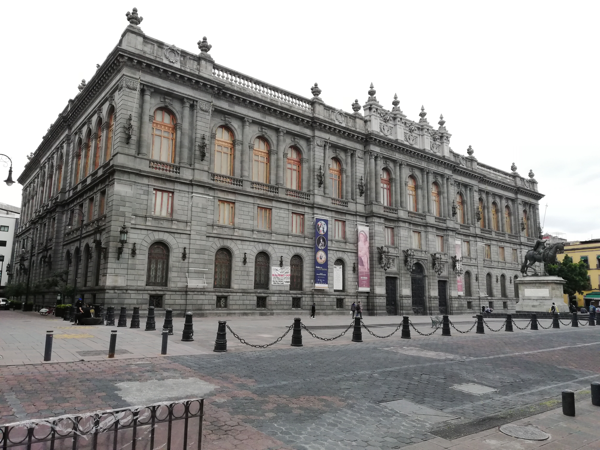

# Oinc-Oinc-Adventures
Let's explore our World
<!DOCTYPE html>
<html lang="es">
<head>
  <meta charset="UTF-8">
  <meta name="viewport" content="width=device-width, initial-scale=1.0">
  <title>Oinc Oinc</title>
  <link rel="stylesheet" href="css/estilos.css">
  <link href='https://unpkg.com/boxicons@2.0.9/css/boxicons.min.css' rel='stylesheet'>
<link href="https://fonts.googleapis.com/css2?family=Open+Sans:wght@300;400;700&display=swap" rel="stylesheet">
</head>
<body>
    <header class="header" id="inicio">
        
        <nav class="menu-navegacion spread">
            <a href="#inicio" class="Letras">Principal</a>
            <a href="#servicio" class="Letras">Know us</a>
            <a href="#galeria" class="Letras">Gallery</a>
            <a href="#descubre" class="Letras">Discover</a>
            <a href="#contacto" class="Letras">Contact</a>
        </nav>
        

            <h1 class="titulo">Discover Mexico and the World with me</h1>
            
If you have a dream, please don't give it up, make it come true

        

    </header>
    <main>
        <section class="services contenedor" id="servicio">
            <h2 class="subtitulo">About us</h2>
            

                
                

                

                    <h3>OI just want to show you all beautiful places</h3>
                    
If you are from another country you can see beautiful parts and places of Mexcio City and some parts of the World.

                

                

                    <h3>OWhat places could you see?</h3>
                    
To be honest, mostly I will show you Mexico City but I can also show you other countries with the help of some friends.

                

                

                    <h3>OWhy did i make this?</h3>
                    
I'm convinced that we can be anywhere imagining it, it's so incredible that our mind can take us anywhere.

                

                 
                 
                 
                 
                

                    <h3>Sculpture</h3>
                    
This series of female sculptures allusive to youth, peace, eloquence, strength and truth.

                

            

            

        </section>
        <section class="gallery" id="galeria">
            

                <h2 class="subtitulo">Gallery</h2>
                

                    
                    
                    
                    
                    
                    
                

            

        </section>
        <section class="imagen-light">
            
            
        </section>
        <section class="contenedor" id="descubre">
            <h2 class="subtitulo">Experts:</h2>
            <section class="experts">
                

                    
                    <h3 class="n-experts">Recommendations</h3>
                

                

                    
                    <h3 class="n-experts">Suggestions</h3>
                

                

                    
                    <h3 class="n-experts">Security</h3>
                

            </section>
        </section>

    </main>
    <footer id="contacto">
        

            

                <h2 class="brand">Oinc Oinc Adventures</h2>
                
We need to explore the World

            

            

                <a href="https://www.instagram.com/oincoincadventures/" class="social-media-icon">
                    <i class='bx bxl-instagram'></i>
                </a>
            

        

        

        

    </footer>

    
    
</body>
</html>
